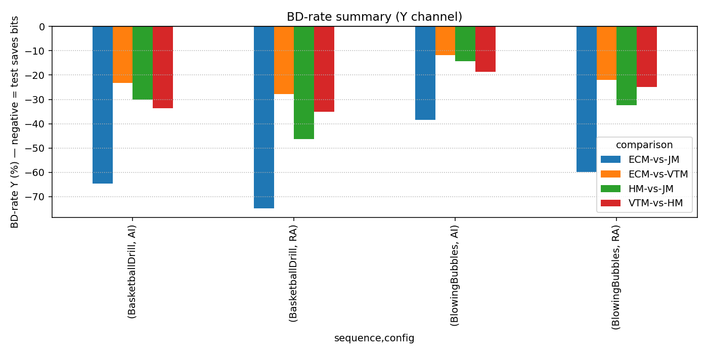
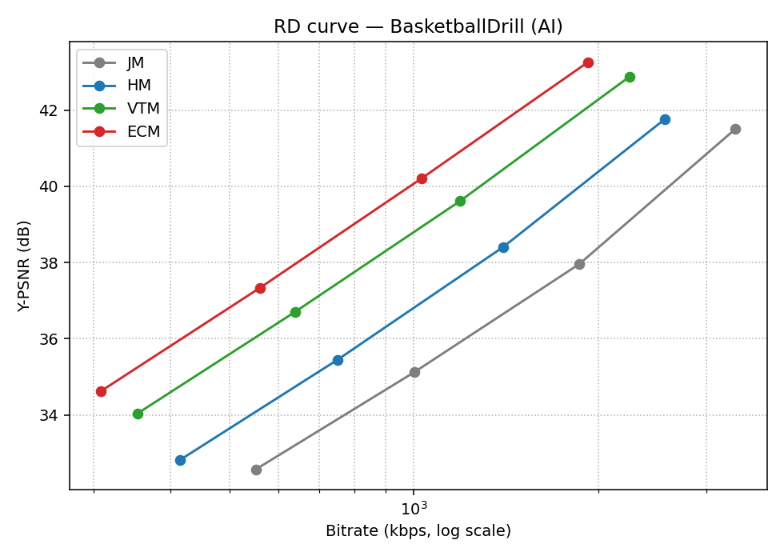
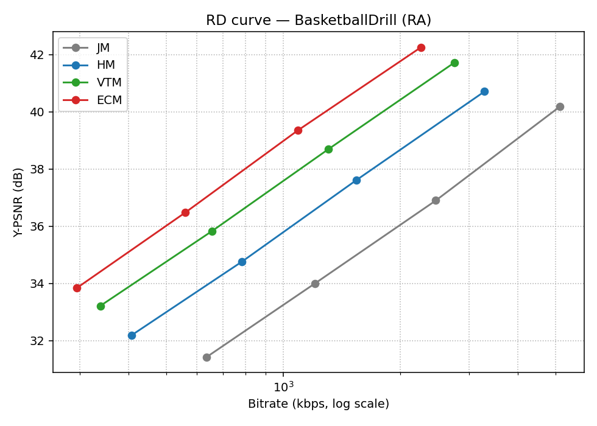
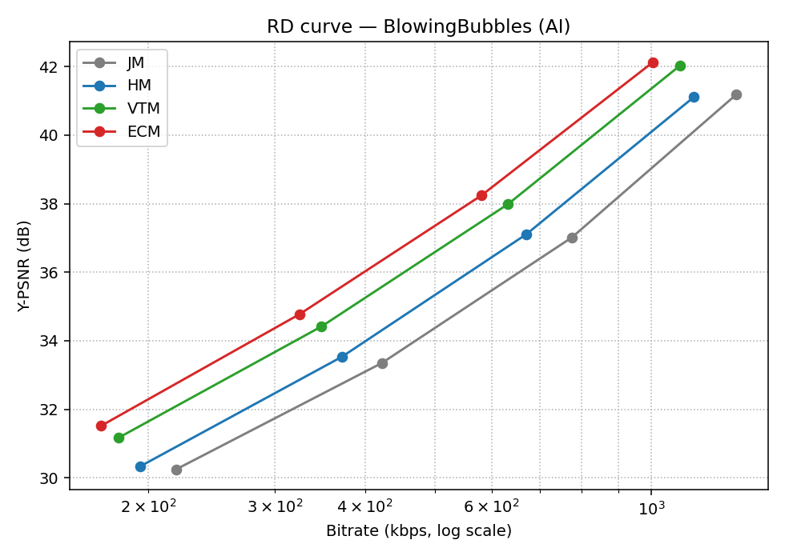
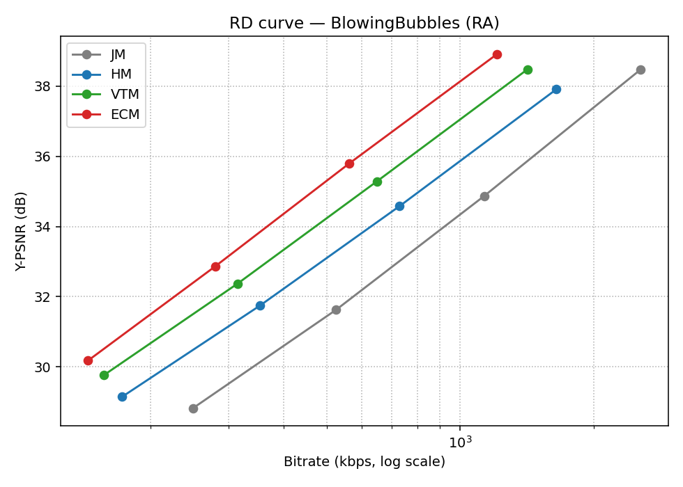
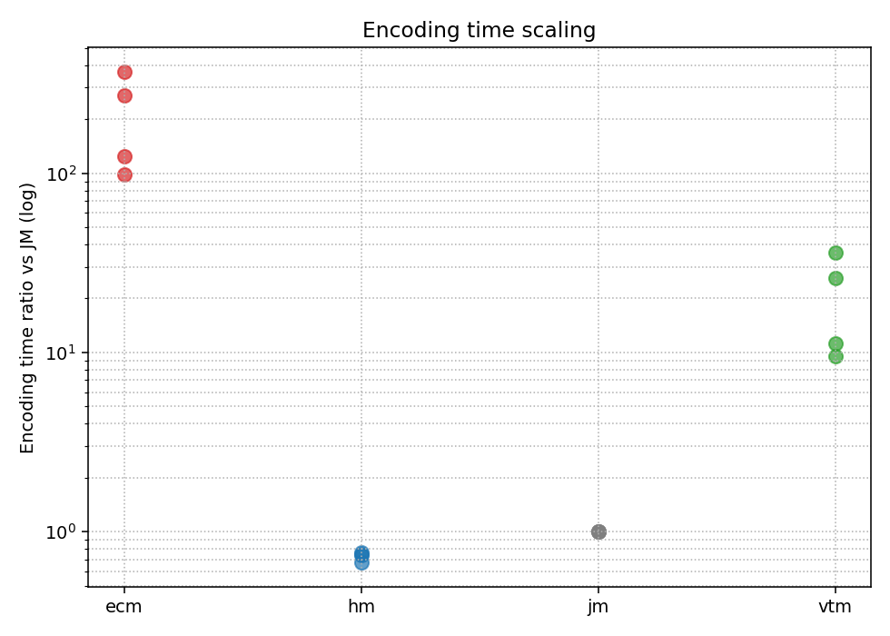

# Codec Comparison — Pilot Report
_Generated from raw_metrics.csv (64 rows)._
## 1. BD-rate (Y channel)
| sequence        | config   | comparison   |      U |      V |      Y |
|:----------------|:---------|:-------------|-------:|-------:|-------:|
| BasketballDrill | AI       | ECM-vs-JM    | -63.26 | -66.88 | -64.54 |
| BasketballDrill | AI       | ECM-vs-VTM   | -23.07 | -24.89 | -23.17 |
| BasketballDrill | AI       | HM-vs-JM     | -31.41 | -31.93 | -30.05 |
| BasketballDrill | AI       | VTM-vs-HM    | -33.61 | -38.45 | -33.63 |
| BasketballDrill | RA       | ECM-vs-JM    | -77.90 | -78.68 | -74.75 |
| BasketballDrill | RA       | ECM-vs-VTM   | -29.08 | -30.51 | -27.76 |
| BasketballDrill | RA       | HM-vs-JM     | -50.01 | -49.32 | -46.40 |
| BasketballDrill | RA       | VTM-vs-HM    | -38.28 | -40.90 | -35.15 |
| BlowingBubbles  | AI       | ECM-vs-JM    | -24.88 | -29.16 | -38.42 |
| BlowingBubbles  | AI       | ECM-vs-VTM   |  -3.33 |  -6.89 | -11.77 |
| BlowingBubbles  | AI       | HM-vs-JM     | -16.02 | -16.43 | -14.20 |
| BlowingBubbles  | AI       | VTM-vs-HM    |  -7.33 |  -9.12 | -18.57 |
| BlowingBubbles  | RA       | ECM-vs-JM    | -59.89 | -62.14 | -59.88 |
| BlowingBubbles  | RA       | ECM-vs-VTM   | -18.51 | -16.49 | -22.08 |
| BlowingBubbles  | RA       | HM-vs-JM     | -39.82 | -42.43 | -32.38 |
| BlowingBubbles  | RA       | VTM-vs-HM    | -18.25 | -21.99 | -24.82 |

## 2. Encoding time ratio (relative to JM)
| sequence        | config   | encoder   |   avg_enc_time_sec |   ratio_vs_jm |
|:----------------|:---------|:----------|-------------------:|--------------:|
| BasketballDrill | AI       | jm        |               7.45 |          1.00 |
| BasketballDrill | AI       | hm        |               5.56 |          0.75 |
| BasketballDrill | AI       | vtm       |             194.84 |         26.14 |
| BasketballDrill | AI       | ecm       |            2021.82 |        271.25 |
| BasketballDrill | RA       | jm        |             153.79 |          1.00 |
| BasketballDrill | RA       | hm        |             117.85 |          0.77 |
| BasketballDrill | RA       | vtm       |            1457.30 |          9.48 |
| BasketballDrill | RA       | ecm       |           15192.02 |         98.79 |
| BlowingBubbles  | AI       | jm        |               2.18 |          1.00 |
| BlowingBubbles  | AI       | hm        |               1.61 |          0.74 |
| BlowingBubbles  | AI       | vtm       |              78.35 |         35.88 |
| BlowingBubbles  | AI       | ecm       |             801.09 |        366.88 |
| BlowingBubbles  | RA       | jm        |              44.63 |          1.00 |
| BlowingBubbles  | RA       | hm        |              30.14 |          0.68 |
| BlowingBubbles  | RA       | vtm       |             503.31 |         11.28 |
| BlowingBubbles  | RA       | ecm       |            5578.11 |        124.98 |

## 3. Figures

## 4. Raw metrics
See `results/raw_metrics.csv` for per-job numbers.
